# CampusConnect — Complete Software Engineering Project Report

> **Document Type:** Major Project / Final Year Engineering / Portfolio Documentation  
> **Based on:** Full source-code analysis of `campus-api` (backend) and `campus-web` (frontend)  
> **Analysis Date:** July 31, 2026  
> **Important:** Features not found in the codebase are marked **Future Scope** or **Not Implemented**. No functionality has been invented.

---

## Table of Contents

1. [Cover Page](#1-cover-page)
2. [Abstract](#2-abstract)
3. [Introduction](#3-introduction)
4. [Literature Survey](#4-literature-survey)
5. [Problem Statement](#5-problem-statement)
6. [Project Objectives](#6-project-objectives)
7. [Complete Technology Stack](#7-complete-technology-stack)
8. [Project Architecture](#8-project-architecture)
9. [Folder Structure](#9-folder-structure)
10. [Database Design](#10-database-design)
11. [Authentication Module](#11-authentication-module)
12. [User Management](#12-user-management)
13. [Admin Module](#13-admin-module)
14. [Chat Module](#14-chat-module)
15. [Voice & Video Calling](#15-voice--video-calling)
16. [Campus AI Module](#16-campus-ai-module)
17. [API Documentation](#17-api-documentation)
18. [Backend Modules](#18-backend-modules)
19. [Frontend Modules](#19-frontend-modules)
20. [Security Features](#20-security-features)
21. [Performance Optimizations](#21-performance-optimizations)
22. [Responsive Design](#22-responsive-design)
23. [Testing](#23-testing)
24. [Code Quality](#24-code-quality)
25. [Project Workflow](#25-project-workflow)
26. [Future Scope](#26-future-scope)
27. [Challenges Faced](#27-challenges-faced)
28. [Conclusion](#28-conclusion)
29. [References](#29-references)

---

# 1. Cover Page

| Field | Details |
|-------|---------|
| **Project Name** | CampusConnect |
| **Project Type** | Full-Stack Web Application — Campus Communication & Real-Time Chat Platform |
| **Author** | Mansi Thakur |
| **Role** | Full-Stack Developer |
| **Institution Context** | Engineering Major Project / Internship Portfolio |
| **Technology Stack** | React 19 · Vite 8 · Tailwind CSS 3 · Node.js · Express 5 · MongoDB · Mongoose 9 · Socket.IO 4 · WebRTC · JWT |
| **Repository Structure** | Monorepo: `campus-web/` (frontend) + `campus-api/` (backend) |
| **Date** | July 31, 2026 |
| **Version** | 1.0.0 |

> **[Screenshot Placeholder: Cover Page with CampusConnect Logo and Dashboard Preview]**

---

# 2. Abstract

CampusConnect is a full-stack campus communication platform designed to unify real-time messaging, role-based user management, and administrative oversight within educational institutions. The system addresses fragmented communication across students, teachers, and administrators by providing a centralized, department-aware chat environment with structured onboarding, teacher approval workflows, and administrative CRUD for academic structure.

The platform implements a **React 19 single-page application** (SPA) built with Vite and Tailwind CSS, communicating with a **Node.js/Express 5 REST API** backed by **MongoDB**. Real-time features are powered by **Socket.IO**, including live messaging, typing indicators, read receipts, presence tracking, and **WebRTC-based audio/video calling** with mesh peer connections.

Authentication uses **JWT access tokens** (Bearer header, 15-minute default expiry) combined with **HttpOnly refresh-token cookies** stored in server-side sessions with SHA-256 hashing and MongoDB TTL expiration. Role-based access control (RBAC) governs student, teacher, and admin capabilities, with a dedicated teacher approval gate before chat access.

**Technologies:** React, Vite, Tailwind CSS, Axios, React Router, React Hook Form, Zod, Socket.IO Client, Express, Mongoose, bcrypt, Helmet, Multer, Nodemailer, Vitest, Supertest.

**Outcome:** A production-oriented MERN-stack application with 9 MongoDB collections, 60+ REST endpoints, 30+ Socket.IO events, WebRTC call signaling, file/voice message uploads, and 59 automated tests (41 backend + 18 frontend). The **Campus AI module (Gemini integration) is not implemented** in the current codebase and is documented as future scope.

---

# 3. Introduction

## 3.1 What is CampusConnect?

CampusConnect is a **Full Stack MERN Chat & Campus Communication Platform** (as stated in the project README). It enables:

- **Students** to complete profiles, chat with eligible peers and teachers, join department/year-scoped groups, and participate in audio/video calls.
- **Teachers** to register, await admin approval, communicate within department boundaries, create teacher groups, and conduct calls.
- **Administrators** to manage departments, academic years, user accounts, teacher approvals, and platform-wide chat.

The UI follows a **Discord-inspired dark theme** with glassmorphism cards, responsive layouts, and role-specific dashboards.

## 3.2 Existing Problems in Campus Communication

| Problem | Description |
|---------|-------------|
| **Fragmented channels** | Students use WhatsApp, email, and informal groups with no institutional structure |
| **No role enforcement** | General messaging apps cannot enforce teacher approval or department boundaries |
| **Poor admin visibility** | Admins lack centralized user/department management tied to communication |
| **Unverified identities** | Informal platforms allow unverified accounts without email verification |
| **No academic context** | Generic tools lack department, year, and teaching-year scoping |
| **Scattered file sharing** | Attachments and voice notes are not tied to conversation history |

## 3.3 Proposed Solution

CampusConnect provides:

1. **Verified registration** with email confirmation before activation
2. **Profile completion** enforcing department and academic year assignment
3. **Teacher approval workflow** requiring admin authorization before chat access
4. **Policy-driven chat eligibility** via `chatPolicyService` (same department, role rules, group types)
5. **Real-time messaging** with Socket.IO (typing, receipts, reactions, edits, pins, forwards)
6. **WebRTC calling** with server-side signaling and ICE server configuration
7. **Admin panel** for departments, academic years, users, and statistics

## 3.4 Benefits

- Centralized, institution-scoped communication
- Enforced onboarding and identity verification
- Real-time collaboration with presence and notifications
- Administrative control over academic structure and user lifecycle
- Extensible REST + Socket architecture for future modules

## 3.5 Objectives

See [Section 6](#6-project-objectives) for the complete objective list.

---

# 4. Literature Survey

## 4.1 Comparison with Existing Platforms

| Feature | WhatsApp | MS Teams | Google Classroom | Discord | Slack | **CampusConnect** |
|---------|----------|----------|------------------|---------|-------|-------------------|
| **Primary audience** | General public | Enterprise | Education (assignments) | Communities/gaming | Workplace | **Campus (students/teachers/admins)** |
| **Email verification gate** | Phone-based | Org account | Google account | Email optional | Workspace invite | **Mandatory email verification** |
| **Teacher approval workflow** | No | Admin-managed | Teacher role via admin | No | Workspace admin | **Dedicated pending/approved/rejected flow** |
| **Department/year scoping** | No | Teams/channels | Classes | Server roles | Channels | **Department + academic year in User model & chat policy** |
| **Real-time chat** | Yes | Yes | Limited (comments) | Yes | Yes | **Yes (Socket.IO)** |
| **Voice/video calls** | Yes | Yes | Google Meet integration | Yes | Huddles | **WebRTC mesh + Socket signaling** |
| **Admin CRUD for academic structure** | No | Limited | Yes (classes) | Server settings | Workspace admin | **Department + AcademicYear CRUD** |
| **Message edit/delete/reactions** | Partial | Yes | No | Yes | Yes | **Yes (15-min edit window)** |
| **AI assistant** | Meta AI | Copilot | Gemini in Workspace | Clyde (limited) | Slack AI | **Not implemented (Future Scope)** |
| **Open/self-hosted** | No | No | No | Partial | No | **Full MERN source control** |

## 4.2 Why CampusConnect is Different

CampusConnect is **purpose-built for academic institutions**, not adapted from enterprise or consumer messaging:

1. **Chat policy engine** (`chatPolicyService.js`) enforces who can message whom based on role, department, year, and conversation type — not available in WhatsApp or Discord out of the box.
2. **Teacher approval gate** is a first-class state machine (`pending` → `approved` / `rejected`), integrated into routing (`ProtectedRoute.jsx`) and socket auth.
3. **Academic structure models** (Department, AcademicYear) are linked to user profiles and group creation.
4. **Conversation types** include `direct`, `teacher_group`, `official_group`, and `announcement` — reflecting campus-specific use cases.
5. **Unified admin dashboard** combines user management, teacher approval, and academic CRUD in one platform.

---

# 5. Problem Statement

## 5.1 Communication Issues in Colleges

Students and faculty rely on disparate channels (WhatsApp groups, email, physical notice boards). This leads to:

- Missed announcements
- Unofficial/unverified group memberships
- No audit trail for institutional communication

**CampusConnect solution:** Centralized chat with verified accounts, conversation history, and in-app notifications.

## 5.2 Department Coordination

Cross-department noise and irrelevant messages dilute important communication.

**CampusConnect solution:** Users are assigned to departments; `canStartDirectChat` and `buildEligibleUsersQuery` filter eligible contacts by department and role.

## 5.3 Teacher Approval

Institutions must vet faculty before granting communication privileges.

**CampusConnect solution:** Teachers register with `teacherApprovalStatus: pending`; admins approve/reject via `/admin/teachers/:id/approve|reject`; rejected teachers see a dedicated page; pending teachers cannot use chat or sockets.

## 5.4 Student Interaction

Students need structured peer and teacher communication within their academic year.

**CampusConnect solution:** Student profile requires department + year (1–10); group conversations can scope `academicYears`; teacher groups respect teaching years.

## 5.5 AI Assistance

**Status: Not Implemented**

The prompt template referenced a Campus AI / Gemini module. **No Gemini, OpenAI, or generative AI code exists** in the repository (verified via full-repo search). This remains **Future Scope** (Section 16).

---

# 6. Project Objectives

| # | Objective | Implementation Status |
|---|-----------|----------------------|
| O1 | Build a secure multi-role authentication system | ✅ JWT + refresh cookies + sessions |
| O2 | Implement email verification before account activation | ✅ Token hash + Nodemailer |
| O3 | Enforce profile completion for students and teachers | ✅ Profile routes + ProtectedRoute redirects |
| O4 | Implement teacher approval workflow | ✅ Admin approve/reject + status pages |
| O5 | Provide admin dashboard with statistics | ✅ User counts, pending teachers |
| O6 | CRUD for departments and academic years | ✅ Full admin API + frontend pages |
| O7 | Admin user management (search, filter, activate/deactivate, delete) | ✅ AdminUsersPage + adminController |
| O8 | Real-time one-to-one and group chat | ✅ Socket.IO + Conversation model |
| O9 | Message features: edit, delete, react, pin, forward, search | ✅ REST + socket handlers |
| O10 | File and voice message attachments | ✅ Multer + VoiceRecorder component |
| O11 | Typing indicators and read receipts | ✅ Socket events + MessageReceipt model |
| O12 | Online presence tracking | ✅ socketPresence + presence events |
| O13 | In-app notifications | ✅ Notification model + NotificationCenter |
| O14 | Audio/video calling via WebRTC | ✅ callService + useWebRTCCall |
| O15 | Responsive UI for mobile, tablet, desktop | ✅ Tailwind breakpoints throughout |
| O16 | Automated testing for critical paths | ✅ 59 tests (Vitest) |
| O17 | Campus AI assistant with Gemini | ❌ **Future Scope** |
| O18 | Forgot/reset password flow | ❌ **Future Scope** |

---

# 7. Complete Technology Stack

## 7.1 Frontend

| Technology | Version | Purpose & Rationale |
|------------|---------|---------------------|
| **React** | 19.2.7 | Component-based UI; latest concurrent features |
| **React DOM** | 19.2.7 | DOM rendering |
| **Vite** | 8.1.1 | Fast dev server, HMR, optimized production builds |
| **Tailwind CSS** | 3.4.19 | Utility-first styling; responsive breakpoints (`sm:`, `md:`, `lg:`) |
| **PostCSS + Autoprefixer** | 8.5.21 / 10.5.4 | CSS processing pipeline |
| **React Router DOM** | 7.18.1 | Client-side routing, protected/guest routes, lazy loading |
| **Axios** | 1.18.1 | HTTP client with interceptors for JWT refresh queue |
| **Socket.IO Client** | 4.8.3 | Real-time messaging, presence, call signaling |
| **React Hook Form** | 7.83.0 | Performant form state for auth pages |
| **Zod** | 4.4.3 | Schema validation (login, register, admin login) |
| **@hookform/resolvers** | 5.5.3 | Bridges Zod schemas to React Hook Form |
| **react-hot-toast** | 2.6.0 | Non-blocking toast notifications |
| **react-icons** | 5.7.0 | Feather-style icons (`react-icons/fi`) |
| **emoji-picker-react** | 4.19.1 | Emoji insertion in chat (`ChatEmojiPicker.jsx`) |
| **Vitest** | 4.1.10 | Unit testing framework |
| **@testing-library/react** | 16.3.2 | Component testing (SocketProvider) |
| **jsdom** | 29.1.1 | DOM environment for tests |
| **ESLint** | 10.6.0 | Code linting |

**Not used in frontend:** Redux, Zustand, TypeScript, Markdown rendering libraries, AI SDKs.

## 7.2 Backend

| Technology | Version | Purpose & Rationale |
|------------|---------|---------------------|
| **Node.js** | (ES Modules) | JavaScript runtime |
| **Express** | 5.2.1 | HTTP server, routing, middleware pipeline |
| **MongoDB / Mongoose** | 9.8.x | Document database with schema validation, indexes, TTL |
| **Socket.IO** | 4.8.3 | WebSocket server sharing HTTP port |
| **jsonwebtoken** | 9.0.3 | Access/refresh JWT creation and verification |
| **bcrypt** | 6.0.0 | Password hashing (configurable salt rounds, default 12) |
| **Zod** | 4.4.3 | Request body and param validation |
| **Helmet** | 8.3.0 | Security HTTP headers |
| **CORS** | 2.8.6 | Cross-origin requests from `CLIENT_URL` |
| **cookie-parser** | 1.4.7 | Parse HttpOnly refresh token cookies |
| **Morgan** | 1.11.0 | HTTP request logging (`"dev"` format) |
| **Multer** | 2.2.0 | Multipart file uploads to `uploads/chat/` |
| **Nodemailer** | 9.0.3 | Verification and welcome emails |
| **dotenv** | 17.4.2 | Environment variable loading |
| **uuid** | 14.0.1 | Unique identifiers |
| **Vitest + Supertest** | 4.1.10 / 7.2.2 | Integration and API testing |
| **mongodb-memory-server** | 11.2.0 | In-memory MongoDB for tests |
| **socket.io-client** | 4.8.3 | Socket integration tests |

**Listed but unused:** `express-validator` (dependency present, validation uses Zod instead).

**Not present:** Gemini AI SDK, express-rate-limit, Redis, TURN/SFU media server.

---

# 8. Project Architecture

## 8.1 High-Level Architecture

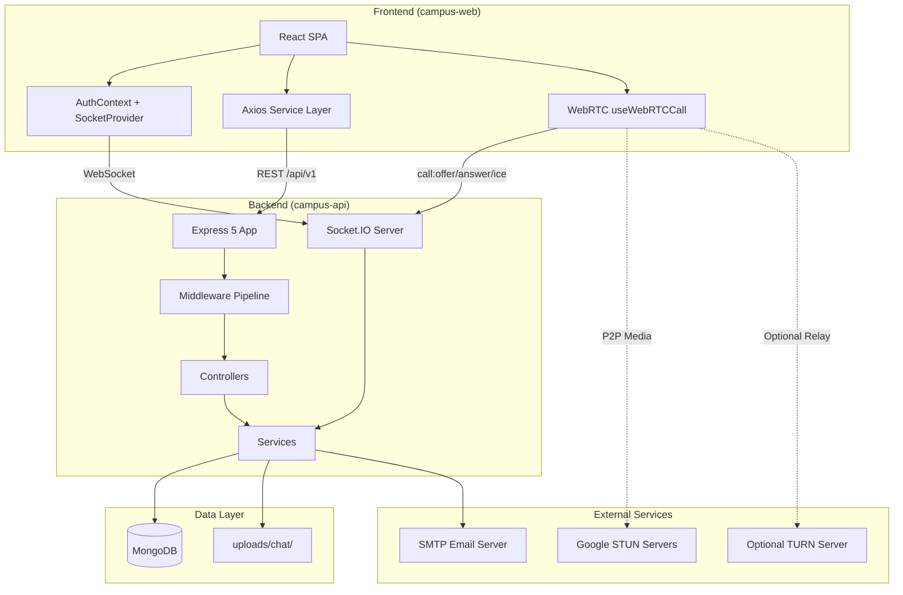

## 8.2 Request Flow (REST)

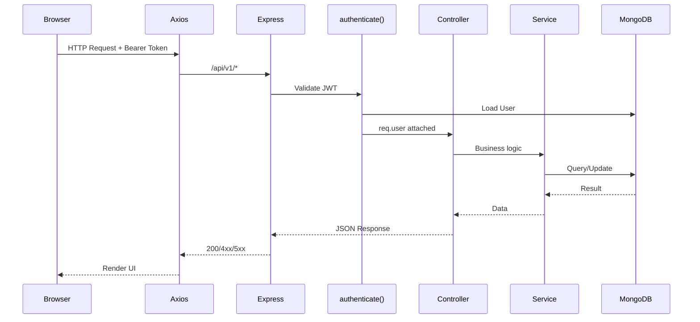

## 8.3 Real-Time Flow (Socket.IO)

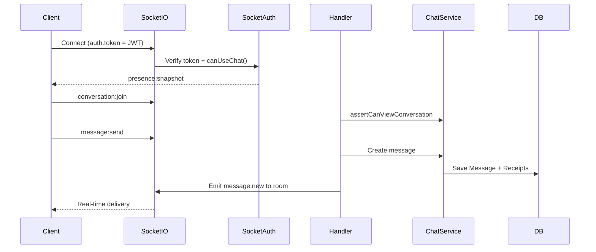

## 8.4 Layer Explanation

| Layer | Responsibility |
|-------|----------------|
| **Frontend UI** | Pages, components, layouts; role-specific dashboards and ChatPage |
| **Frontend Context** | Auth state, socket connection, online presence |
| **Frontend Services** | Thin API wrappers over Axios instance |
| **REST API** | Stateless HTTP endpoints under `/api/v1` |
| **Middleware** | Auth, RBAC, Zod validation, Multer uploads, error handling |
| **Controllers** | HTTP request/response mapping |
| **Services** | Business logic, chat policy, token/session management |
| **Models** | Mongoose schemas with indexes and relationships |
| **Socket Server** | Real-time events, rate limiting, room management |
| **MongoDB** | Persistent storage with TTL on sessions |
| **WebRTC** | Client-side P2P media; server relays SDP/ICE only |

---

# 9. Folder Structure

## 9.1 Repository Root

```
campus connect/
├── campus-api/          # Backend (Node.js + Express)
├── campus-web/          # Frontend (React + Vite)
├── docs/                # Project documentation
├── README.md
└── .gitignore
```

## 9.2 Backend (`campus-api/`)

| Directory/File | Purpose |
|----------------|---------|
| `src/app.js` | Express app: Helmet, CORS, Morgan, JSON parser, route mounting |
| `src/server.js` | HTTP server creation, Socket.IO initialization, DB connect |
| `src/config/` | Database connection, email transporter |
| `src/constants/` | Roles, status codes, message constants |
| `src/controllers/` | HTTP handlers: auth, profile, admin, chat |
| `src/controllers/admin/` | Department and academic year controllers |
| `src/emails/` | HTML email templates for verification/welcome |
| `src/middleware/` | authenticate, authorize, validateRequest, upload, errorHandler |
| `src/models/` | 9 Mongoose models |
| `src/routes/` | Express routers mounted at `/api/v1/*` |
| `src/services/` | Business logic layer (12 service modules) |
| `src/sockets/` | Socket.IO server, handlers, auth, presence, rooms |
| `src/utils/` | ApiError, asyncHandler, authCookies, chatErrors |
| `src/validators/` | Zod schemas per domain |
| `seeders/seedAdmin.js` | Bootstrap admin user from env vars |
| `tests/` | 5 Vitest test files (41 test cases) |
| `uploads/chat/` | Runtime directory for Multer uploads |
| `postman/` | API collections for manual testing |

## 9.3 Frontend (`campus-web/`)

| Directory/File | Purpose |
|----------------|---------|
| `src/main.jsx` | Entry: BrowserRouter → AuthProvider → SocketProvider → App |
| `src/App.jsx` | AppRoutes + global Toaster |
| `src/pages/` | Route-level pages by domain (auth, admin, chat, public, student, teacher) |
| `src/components/` | Reusable UI: chat, admin forms, common, layout |
| `src/context/` | AuthContext (user state, login/logout) |
| `src/hooks/` | useAuth, useWebRTCCall |
| `src/layouts/` | PublicLayout |
| `src/routes/` | AppRoutes, ProtectedRoute, GuestRoute, RoleRoute (unused) |
| `src/services/` | API service modules (auth, chat, admin, profile, department, academicYear) |
| `src/socket/` | socketClient singleton, SocketProvider, useSocket, emitWithAck |
| `src/utils/` | Pure functions: chat state reducers, error mapping |
| `public/` | Static assets (logo, icons) |
| `src/test/setup.js` | Vitest DOM setup |

---

# 10. Database Design

## 10.1 Entity-Relationship Diagram

```mermaid
erDiagram
    User ||--o{ Session : has
    User ||--o| Department : belongs_to
    User ||--o{ Conversation : creates
    User ||--o{ Message : sends
    User ||--o{ MessageReceipt : receives
    User ||--o{ Notification : receives
    User ||--o{ Call : initiates

    Department ||--o{ AcademicYear : contains
    Department ||--o{ Conversation : scopes

    Conversation ||--o{ Message : contains
    Conversation ||--o{ MessageReceipt : tracks
    Conversation ||--o{ Call : hosts
    Conversation ||--o{ Notification : references

    Message ||--o{ MessageReceipt : has
    Message ||--o| Message : replyTo
    Message ||--o{ Message : reactions

    Call ||--o{ Notification : triggers

    User {
        ObjectId _id PK
        string name
        string email UK
        string password
        enum role
        boolean isEmailVerified
        enum teacherApprovalStatus
        ObjectId department FK
        number year
        array teachingYears
        boolean profileCompleted
        boolean isActive
        date lastSeenAt
    }

    Session {
        ObjectId _id PK
        ObjectId user FK
        string sessionId UK
        string refreshTokenHash
        date expiresAt TTL
    }

    Department {
        ObjectId _id PK
        string name UK
        string code UK
        number durationInYears
        boolean isActive
    }

    AcademicYear {
        ObjectId _id PK
        ObjectId department FK
        number yearNumber
        string name
    }

    Conversation {
        ObjectId _id PK
        enum type
        string directKey UK
        array members
        ObjectId department FK
        array academicYears
        ObjectId lastMessage FK
    }

    Message {
        ObjectId _id PK
        ObjectId conversation FK
        ObjectId sender FK
        enum type
        string text
        array attachments
        array reactions
        boolean deletedForEveryone
    }

    MessageReceipt {
        ObjectId _id PK
        ObjectId message FK
        ObjectId user FK
        date deliveredAt
        date seenAt
    }

    Notification {
        ObjectId _id PK
        ObjectId user FK
        enum type
        ObjectId conversation FK
        ObjectId message FK
        boolean isRead
    }

    Call {
        ObjectId _id PK
        ObjectId conversation FK
        ObjectId caller FK
        enum type
        enum status
        array participants
    }
```

## 10.2 Collection Documentation

### 10.2.1 Users Collection

| Attribute | Details |
|-----------|---------|
| **Purpose** | Store all platform users (students, teachers, admins) |
| **Model File** | `campus-api/src/models/User.js` |
| **Relationships** | → Department; ← Session, Message, Conversation members |
| **Key Fields** | `email` (unique), `role`, `teacherApprovalStatus`, `department`, `year`, `teachingYears`, `profileCompleted`, `isActive` |
| **Indexes** | Unique on `email` (implicit) |
| **TTL** | None |
| **Methods** | `comparePassword()`, `canLogin()`, `toJSON()` (strips secrets) |

### 10.2.2 Sessions Collection

| Attribute | Details |
|-----------|---------|
| **Purpose** | Refresh token sessions for multi-device login |
| **Key Fields** | `sessionId`, `refreshTokenHash` (SHA-256), `expiresAt`, device metadata |
| **Indexes** | `{ user: 1 }`, `{ sessionId: 1 }` unique, `{ expiresAt: 1 }` **TTL**, compound `{ user, sessionId }` |
| **TTL** | **Yes** — MongoDB automatically deletes expired sessions |

### 10.2.3 Departments Collection

| Attribute | Details |
|-----------|---------|
| **Purpose** | Academic departments (e.g., CSE, ECE) |
| **Key Fields** | `name`, `code` (uppercase), `durationInYears`, `isActive` |
| **Indexes** | Unique on `name` and `code`; text index on name/code/description |

### 10.2.4 AcademicYears Collection

| Attribute | Details |
|-----------|---------|
| **Purpose** | Year definitions per department (Year 1, Year 2, etc.) |
| **Key Fields** | `department`, `yearNumber`, `name`, `sortOrder` |
| **Indexes** | Unique compound `{ department, yearNumber }` |

### 10.2.5 Conversations Collection

| Attribute | Details |
|-----------|---------|
| **Purpose** | Direct chats and group conversations |
| **Types** | `direct`, `teacher_group`, `official_group`, `announcement` |
| **Key Fields** | `members[]` (with unreadCount, isPinned, lastReadAt), `directKey`, `department`, `academicYears`, `onlyAdminsCanSend` |
| **Indexes** | Partial unique on `directKey`; compound indexes for member queries and sorting |

### 10.2.6 Messages Collection

| Attribute | Details |
|-----------|---------|
| **Purpose** | Chat messages with rich metadata |
| **Types** | `text`, `system`, `image`, `file`, `voice`, `call` |
| **Key Fields** | `text`, `attachments[]`, `voice`, `reactions[]`, `replyTo`, edit/delete fields, `callMeta`, `temporaryId` (idempotency) |
| **Indexes** | Conversation + createdAt (cursor pagination); unique partial on sender + temporaryId |

### 10.2.7 MessageReceipts Collection

| Attribute | Details |
|-----------|---------|
| **Purpose** | Authoritative delivery and read tracking (replaces deprecated arrays on Message) |
| **Key Fields** | `deliveredAt`, `seenAt` |
| **Indexes** | Unique `{ message, user }`; conversation + user; conversation + seenAt |

### 10.2.8 Notifications Collection

| Attribute | Details |
|-----------|---------|
| **Purpose** | In-app notification feed |
| **Types** | `message`, `reply`, `reaction`, `mention`, `group`, `call` |
| **Indexes** | `{ user, createdAt }`, `{ user, isRead, createdAt }` |

### 10.2.9 Calls Collection

| Attribute | Details |
|-----------|---------|
| **Purpose** | Audio/video call state and participants |
| **Types** | `audio`, `video`; Modes: `direct`, `group` |
| **Statuses** | `ringing`, `active`, `ended`, `missed`, `rejected`, `busy`, `failed` |
| **Indexes** | `{ conversation, isActive, status }`, `{ participants.user, isActive }` |

---

# 11. Authentication Module

## 11.1 Overview

Authentication uses a **dual-token strategy**:

| Token | Storage | Expiry (default) | Purpose |
|-------|---------|------------------|---------|
| **Access Token** | `localStorage` (`campus_connect_access_token`) | 15 minutes | API Authorization header |
| **Refresh Token** | HttpOnly cookie (`/api/v1/auth` path) | 7 days | Silent token renewal |

Refresh tokens are **hashed (SHA-256)** before storage in the `Session` collection. Comparison uses `crypto.timingSafeEqual`.

## 11.2 Registration Flow

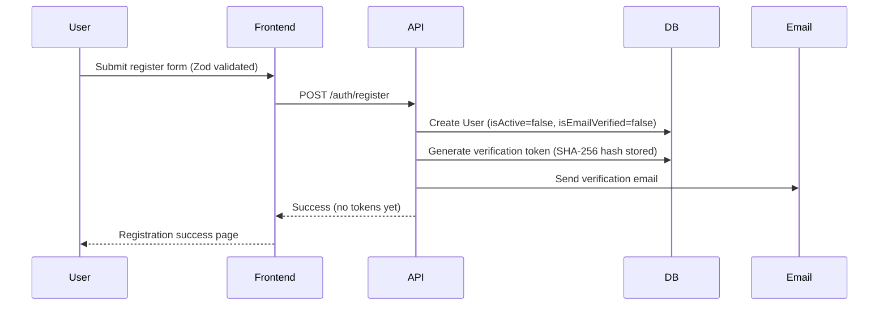

**Role behavior on register:**
- **Student:** `teacherApprovalStatus: not_required`
- **Teacher:** `teacherApprovalStatus: pending`
- **Admin:** Created via seeder only (`seedAdmin.js`), not via public registration

## 11.3 Email Verification

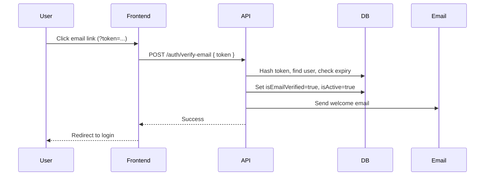

**Resend:** `POST /auth/resend-verification` with email.

## 11.4 Login Flow

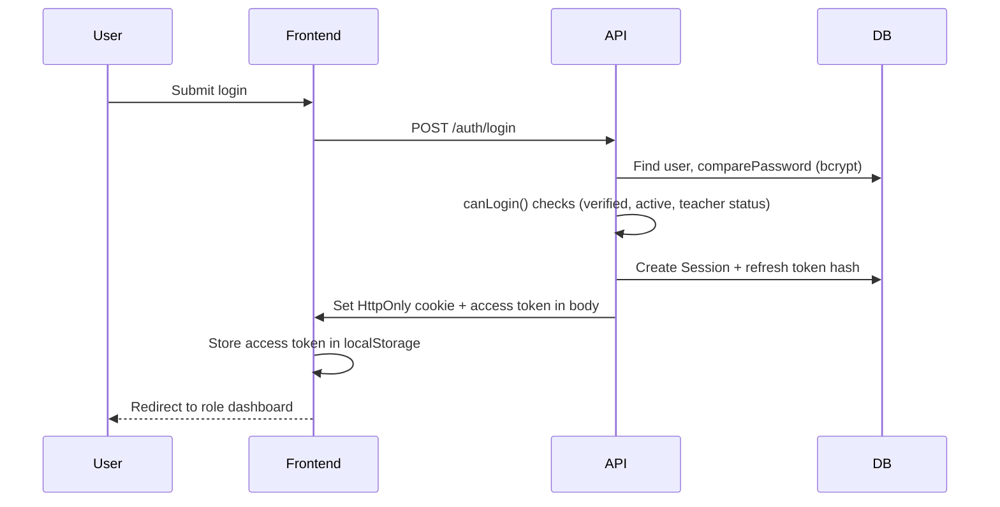

## 11.5 Refresh Token Flow

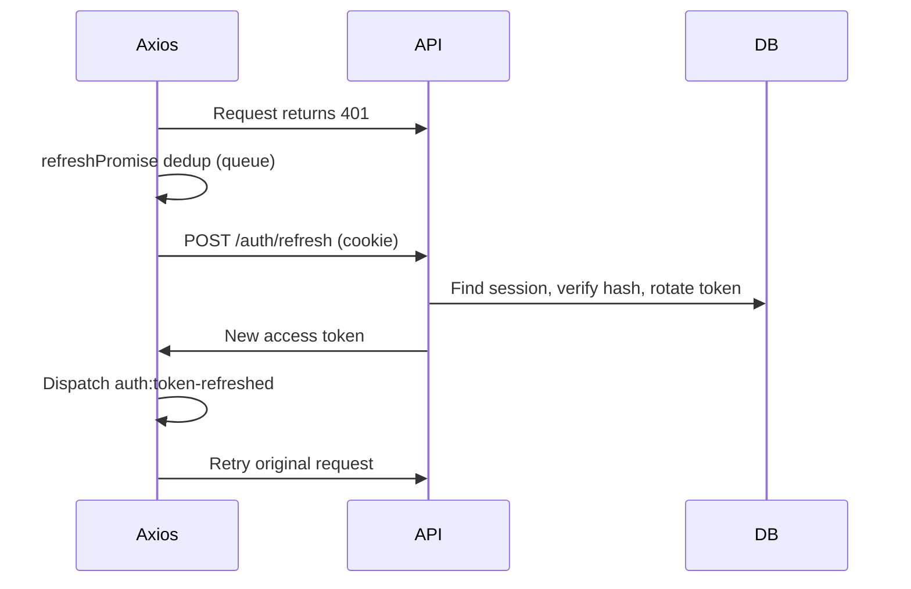

## 11.6 Logout

| Endpoint | Behavior |
|----------|----------|
| `POST /auth/logout` | Revokes current session, clears cookie |
| `POST /auth/logout-all` | Revokes all user sessions (authenticated) |
| `DELETE /auth/sessions/:sessionId` | Revoke specific device session |

## 11.7 Forgot Password / Reset Password

**Status: Not Implemented**

No routes, controllers, models, or frontend pages exist for password reset. Marked as **Future Scope**.

## 11.8 JWT Configuration

| Claim | Value |
|-------|-------|
| Access secret | `JWT_ACCESS_SECRET` (required) |
| Refresh secret | `JWT_REFRESH_SECRET` (required, must differ) |
| Access expiry | `JWT_ACCESS_EXPIRES_IN` (default `15m`) |
| Refresh expiry | `JWT_REFRESH_EXPIRES_IN` (default `7d`) |
| Issuer/Audience | Set in `tokenService.js` |

## 11.9 Role-Based Authentication

| Role | Login Path | Post-Login Gate |
|------|------------|-----------------|
| **Student** | `/login` | Profile completion → dashboard |
| **Teacher** | `/login` | Profile → approval pending → approved dashboard |
| **Admin** | `/admin/login` | Direct to admin dashboard |

`authorize()` middleware restricts admin routes to `role === 'admin'`.

## 11.10 Teacher Approval Integration

Pending/rejected teachers can authenticate (limited access) but:
- `canUseChat()` returns 403
- Socket connection is rejected
- `ProtectedRoute` redirects to `/teacher/approval-pending` or `/teacher/approval-rejected`

---

# 12. User Management

## 12.1 User Roles

| Role | Capabilities |
|------|-------------|
| **Student** | Complete profile (department + year), direct chat with eligible users, join groups, calls |
| **Teacher** | Complete profile (department + teachingYears), create teacher groups, chat after approval |
| **Admin** | Full admin panel, all chat types, user/department management |

## 12.2 Permissions Matrix

| Action | Student | Teacher (approved) | Admin |
|--------|---------|-------------------|-------|
| Use chat | ✅ (profile complete) | ✅ | ✅ |
| Start direct chat | Policy-based | Policy-based | ✅ |
| Create teacher_group | ❌ | ✅ | ✅ |
| Create official_group | ❌ | ❌ | ✅ |
| Manage conversation | Member admin only | Member admin | ✅ |
| Admin dashboard | ❌ | ❌ | ✅ |

## 12.3 Approval Flow

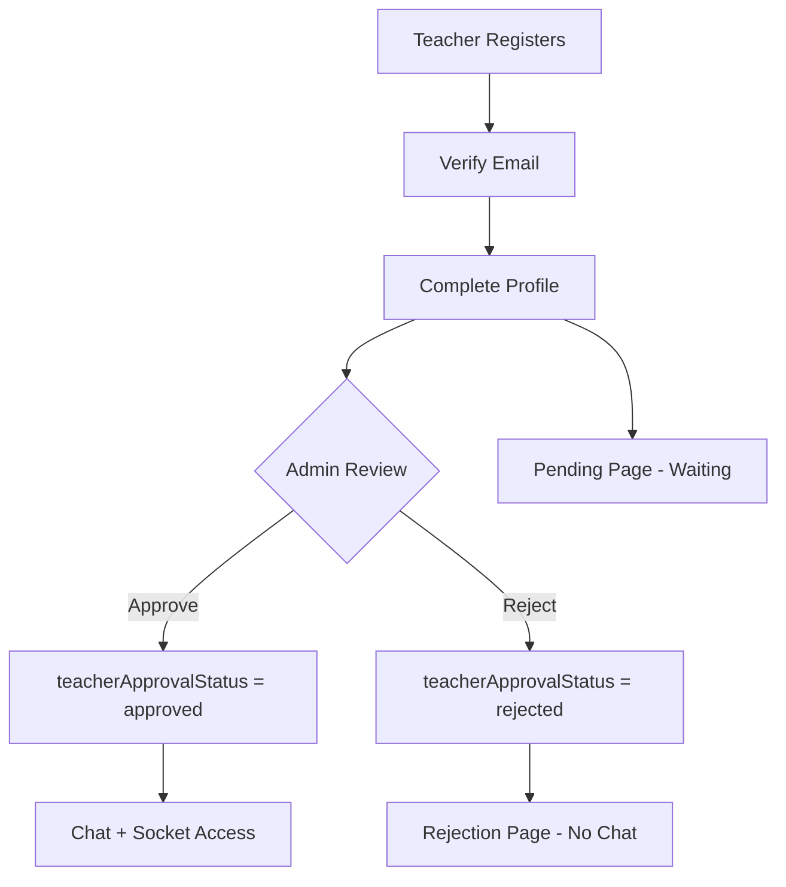

## 12.4 Department Assignment

- **Students:** Select department + year via `PATCH /profile/student`
- **Teachers:** Select department + teachingYears via `PATCH /profile/teacher`
- Options loaded from `GET /profile-options/departments` and `.../years`

## 12.5 Profile Completion

| Field | Student | Teacher |
|-------|---------|---------|
| department | Required | Required |
| year | Required (1–10) | N/A |
| teachingYears | N/A | Required array |
| profileCompleted | Set true on PATCH | Set true on PATCH |

## 12.6 RBAC Implementation

- **HTTP:** `authenticate` → `authorize(['admin'])` on admin routes
- **Chat:** `chatPolicyService` functions (`canSendMessage`, `canManageConversation`, etc.)
- **Socket:** `socketAuth.js` validates JWT + `canUseChat()`
- **Frontend:** `ProtectedRoute` with `allowedRoles` prop

---

# 13. Admin Module

## 13.1 Dashboard

**Endpoint:** `GET /api/v1/admin/dashboard`

| Statistic | Description |
|-----------|-------------|
| totalUsers | All users count |
| totalStudents | role = student |
| totalTeachers | role = teacher |
| pendingTeachers | Verified, profile complete, status = pending |
| activeUsers | isActive = true |
| inactiveUsers | isActive = false |

> **[Screenshot Placeholder: Admin Dashboard with Statistics Cards]**

## 13.2 Teacher Approval

| Action | Endpoint |
|--------|----------|
| List pending | `GET /admin/teachers/pending` |
| Approve | `PATCH /admin/teachers/:id/approve` |
| Reject | `PATCH /admin/teachers/:id/reject` (with optional reason) |

On approval, welcome email is sent via `sendWelcomeEmail`.

## 13.3 Department CRUD

| Method | Endpoint | Description |
|--------|----------|-------------|
| POST | `/admin/departments` | Create department |
| GET | `/admin/departments` | List all |
| GET | `/admin/departments/:id` | Get one |
| PATCH | `/admin/departments/:id` | Update |
| DELETE | `/admin/departments/:id` | Soft/hard delete |

Frontend: `DepartmentsPage.jsx`, `DepartmentForm.jsx`, `DepartmentTable.jsx`

## 13.4 Academic Year CRUD

| Method | Endpoint |
|--------|----------|
| GET | `/admin/departments/:departmentId/years` |
| POST | `/admin/departments/:departmentId/years` |
| GET | `/admin/academic-years/:academicYearId` |
| PATCH | `/admin/academic-years/:academicYearId` |
| DELETE | `/admin/academic-years/:academicYearId` |

Frontend: `AcademicYearsPage.jsx`, `AcademicYearForm.jsx`

## 13.5 User CRUD

| Method | Endpoint | Description |
|--------|----------|-------------|
| GET | `/admin/users` | Paginated list with filters |
| GET | `/admin/users/:id` | Single user |
| PATCH | `/admin/users/:id/status` | Activate/deactivate |
| PATCH | `/admin/users/:id` | Update user fields |
| DELETE | `/admin/users/:id` | Delete (requires `{ confirmation: "DELETE" }`) |

**Query filters:** `type` (students, teachers, pending-teachers, active, inactive, all), `search`, `page`, `limit`

**Search:** Regex-escaped search on name/email (`escapeRegex` utility)

## 13.6 Permissions

All admin routes require:
1. Valid JWT (`authenticate`)
2. `role === 'admin'` (`authorize`)

---

# 14. Chat Module

## 14.1 Conversation Types

| Type | Created By | Purpose |
|------|------------|---------|
| `direct` | Any eligible user | One-to-one messaging |
| `teacher_group` | Teacher/Admin | Department-scoped teacher groups |
| `official_group` | Admin | Official department groups |
| `announcement` | Admin | Broadcast-style (onlyAdminsCanSend) |

## 14.2 One-to-One Chat

- Created via `POST /chat/conversations/direct`
- Deduplicated by `directKey` (sorted user IDs)
- Policy: `canStartDirectChat(currentUser, targetUser)`

## 14.3 Group Chat

- Created via `POST /chat/conversations/groups`
- Members added via `POST .../members`
- Removed via `DELETE .../members/:userId`
- System messages generated on membership changes

## 14.4 Socket.IO Message Flow

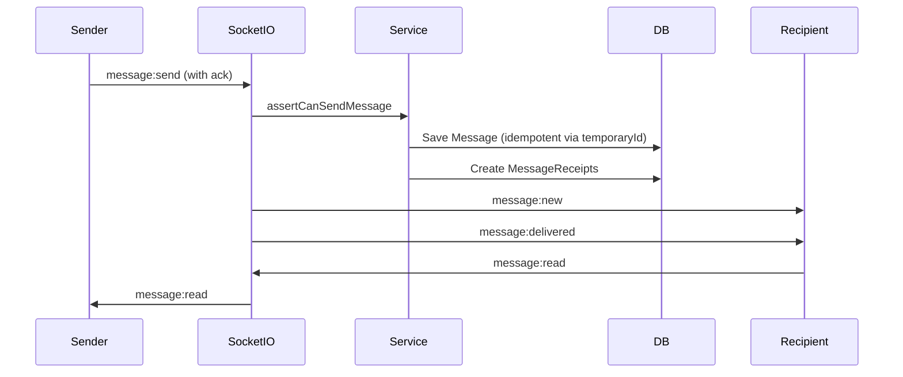

## 14.5 Real-Time Features

| Feature | Socket Event(s) | REST Fallback |
|---------|-----------------|---------------|
| Send message | `message:send` | `POST .../messages` |
| Typing | `message:typing`, `message:stop-typing` | — |
| Read receipts | `message:read` | `PATCH .../read` |
| Edit | `message:edit` | `PATCH /messages/:id` |
| Delete | `message:delete` | `DELETE .../me`, `.../everyone` |
| React | `message:react` | `POST .../reactions` |
| Pin | `message:pin` | `POST .../pin` |
| Forward | `message:forward` | `POST .../forward` |

## 14.6 Message Edit Window

Configurable via `MESSAGE_EDIT_WINDOW_MS` (default **15 minutes** = 900,000 ms).

## 14.7 Attachments & Voice

- **Files:** `POST .../attachments` (Multer, max 5 files, MIME whitelist)
- **Voice:** Recorded client-side (`VoiceRecorder.jsx`), uploaded as attachment
- Static serving: `GET /uploads/chat/*`

## 14.8 Conversation Search

- `GET /conversations/:id/search?q=...` — searches message text
- Frontend search button in ChatPage header

## 14.9 Pinned Groups & Messages

- Conversation pin: `PATCH /conversations/:id/pin` (member `isPinned` flag)
- Message pin: `POST /messages/:id/pin`
- Pinned messages list: `GET /conversations/:id/pinned`

## 14.10 Notifications

- `NotificationCenter.jsx` listens for `notification:new`
- REST: `GET /notifications`, unread count, mark read/all-read

## 14.11 Presence

- `presence:online`, `presence:offline`, `presence:snapshot`
- Tracked via `lastSeenAt` on User model
- Exposed in frontend via `SocketProvider.onlineUsers`

## 14.12 Rate Limiting (Socket)

| Event Category | Limit |
|----------------|-------|
| `message:send` | 40 per 15 seconds per socket |
| Call/signaling events | 120 per 15 seconds per socket |

---

# 15. Voice & Video Calling

## 15.1 Implementation Status: **Fully Implemented** (Signaling + Client WebRTC)

The backend provides **call state management and WebRTC signaling**. Media flows peer-to-peer on the client; there is **no built-in SFU/TURN server**.

## 15.2 Call Lifecycle

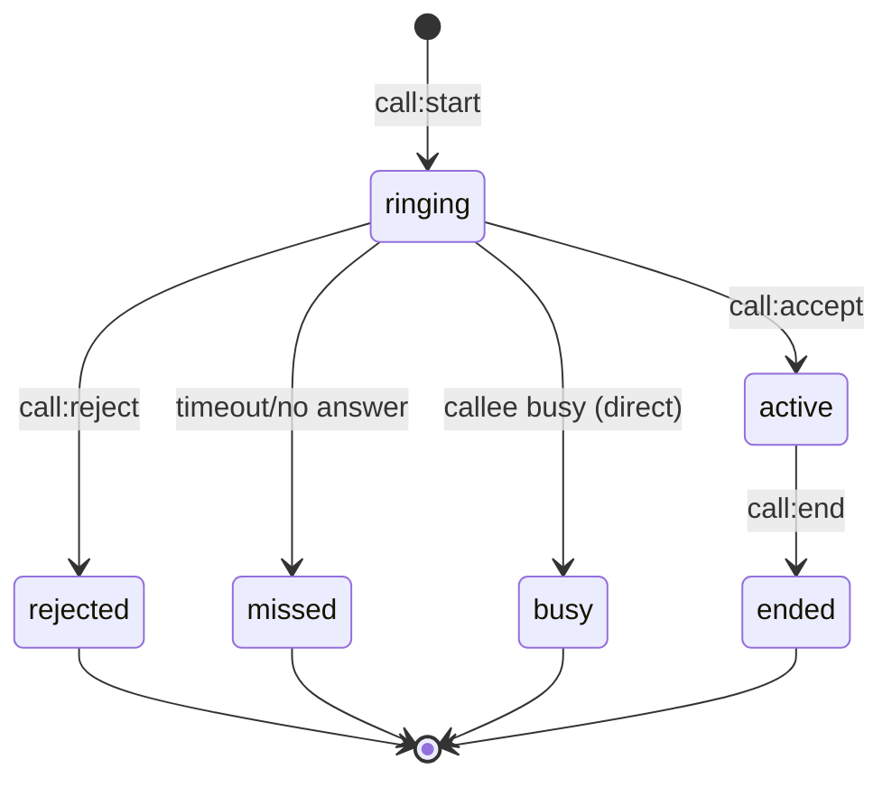

## 15.3 REST Endpoints

| Method | Endpoint | Purpose |
|--------|----------|---------|
| POST | `/chat/conversations/:id/calls` | Start call |
| GET | `/chat/conversations/:id/calls/active` | Get active call |
| GET | `/chat/calls/:callId` | Get call details + ICE servers |
| POST | `/chat/calls/:callId/accept` | Accept |
| POST | `/chat/calls/:callId/reject` | Reject |
| POST | `/chat/calls/:callId/end` | End |

## 15.4 WebRTC Signaling (Socket.IO)

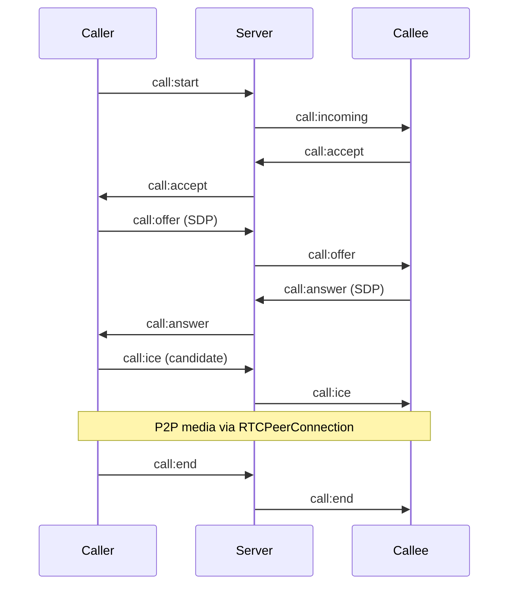

## 15.5 Frontend WebRTC (`useWebRTCCall.js`)

| Feature | Implementation |
|---------|----------------|
| Architecture | **Mesh** — each participant connects to every other |
| API | `RTCPeerConnection`, `getUserMedia`, `getDisplayMedia` |
| ICE servers | From `activeCall.iceServers` or Google STUN default |
| Mute | `call:mute` event + local track enable/disable |
| Camera toggle | `call:camera` + `getUserMedia` with facingMode |
| Screen share | `call:screenShare` + `getDisplayMedia` |
| ICE restart | On failed/disconnected connection state |
| UI | `CallOverlay.jsx` — video tiles, controls, fullscreen |

## 15.6 ICE Server Configuration

| Variable | Default |
|----------|---------|
| `WEBRTC_STUN_URLS` | `stun:stun.l.google.com:19302`, `stun:stun1.l.google.com:19302` |
| `WEBRTC_TURN_URL` | Optional |
| `WEBRTC_TURN_USERNAME` | Optional |
| `WEBRTC_TURN_CREDENTIAL` | Optional |

## 15.7 Limitations

- No server-side media relay (TURN must be configured externally for restrictive NAT)
- Group calls use mesh topology (scalability limited beyond small groups)
- Call end creates a `call`-type system message in conversation

---

# 16. Campus AI Module

## 16.1 Status: **Not Implemented — Future Scope**

A comprehensive search of the entire repository found:

- ❌ No `@google/generative-ai` or Gemini SDK
- ❌ No OpenAI or other LLM dependencies
- ❌ No AI routes, controllers, services, or models
- ❌ No frontend AI pages, components, or services
- ❌ No conversation history, streaming, or audit log infrastructure for AI

The following were **requested in the prompt template** but do **not exist** in code:

| Planned Feature | Status |
|-----------------|--------|
| Gemini Integration | Future Scope |
| AI Conversation History | Future Scope |
| Rename/Delete AI chats | Future Scope |
| Markdown Rendering (AI) | Future Scope |
| Streaming responses | Future Scope |
| AI Rate Limiting | Future Scope |
| AI Ownership checks | Future Scope |
| AI Cursor Pagination | Future Scope |
| AI Audit Logs | Future Scope |

**Note:** Message search and chat features are implemented; they are part of the Chat module, not AI.

---

# 17. API Documentation

**Base URL:** `/api/v1`  
**Auth:** Bearer JWT in `Authorization` header unless marked Public  
**Response format:** `{ success, message, data }`

## 17.1 Health Module

| Method | Endpoint | Auth | Purpose | Status Codes |
|--------|----------|------|---------|--------------|
| GET | `/health` | Public | Server health + DB status | 200 |

## 17.2 Authentication Module

| Method | Endpoint | Auth | Body | Purpose | Status Codes |
|--------|----------|------|------|---------|--------------|
| POST | `/auth/register` | Public | `{ name, email, password, role }` | Register user | 201, 400, 409 |
| POST | `/auth/login` | Public | `{ email, password }` | Login | 200, 401, 403 |
| POST | `/auth/verify-email` | Public | `{ token }` | Verify email | 200, 400 |
| POST | `/auth/resend-verification` | Public | `{ email }` | Resend verification | 200, 404 |
| POST | `/auth/refresh` | Cookie | — | Refresh access token | 200, 401 |
| POST | `/auth/logout` | Cookie | — | Logout current session | 200 |
| GET | `/auth/me` | Bearer | — | Current user | 200, 401 |
| GET | `/auth/sessions` | Bearer | — | List active sessions | 200 |
| DELETE | `/auth/sessions/:sessionId` | Bearer | — | Revoke session | 200, 404 |
| POST | `/auth/logout-all` | Bearer | — | Logout all devices | 200 |

## 17.3 Profile Module

| Method | Endpoint | Auth | Body | Purpose |
|--------|----------|------|------|---------|
| PATCH | `/profile/student` | Bearer | `{ department, year }` | Complete student profile |
| PATCH | `/profile/teacher` | Bearer | `{ department, teachingYears }` | Complete teacher profile |
| GET | `/profile-options/departments` | Bearer | — | List active departments |
| GET | `/profile-options/departments/:id/years` | Bearer | — | Years for department |

## 17.4 Admin Module

| Method | Endpoint | Auth | Purpose |
|--------|----------|------|---------|
| GET | `/admin/dashboard` | Admin | Dashboard statistics |
| GET | `/admin/teachers/pending` | Admin | Pending teachers |
| PATCH | `/admin/teachers/:id/approve` | Admin | Approve teacher |
| PATCH | `/admin/teachers/:id/reject` | Admin | Reject teacher |
| GET | `/admin/users` | Admin | List users (filtered) |
| GET | `/admin/users/:id` | Admin | Get user |
| PATCH | `/admin/users/:id/status` | Admin | Toggle active status |
| PATCH | `/admin/users/:id` | Admin | Update user |
| DELETE | `/admin/users/:id` | Admin | Delete user |
| POST | `/admin/departments` | Admin | Create department |
| GET | `/admin/departments` | Admin | List departments |
| GET | `/admin/departments/:id` | Admin | Get department |
| PATCH | `/admin/departments/:id` | Admin | Update department |
| DELETE | `/admin/departments/:id` | Admin | Delete department |
| GET | `/admin/departments/:id/years` | Admin | List academic years |
| POST | `/admin/departments/:id/years` | Admin | Create academic year |
| GET | `/admin/academic-years/:id` | Admin | Get academic year |
| PATCH | `/admin/academic-years/:id` | Admin | Update academic year |
| DELETE | `/admin/academic-years/:id` | Admin | Delete academic year |

## 17.5 Chat Module

| Method | Endpoint | Auth | Purpose |
|--------|----------|------|---------|
| GET | `/chat/eligible-users` | Bearer | Users available to chat |
| GET | `/chat/conversations` | Bearer | List conversations |
| POST | `/chat/conversations/direct` | Bearer | Create/get direct chat |
| POST | `/chat/conversations/groups` | Bearer | Create group |
| GET | `/chat/conversations/:id` | Bearer | Get conversation |
| PATCH | `/chat/conversations/:id` | Bearer | Update conversation |
| DELETE | `/chat/conversations/:id` | Bearer | Delete/leave conversation |
| GET | `/chat/conversations/:id/messages` | Bearer | Paginated messages (`?before=&limit=`) |
| POST | `/chat/conversations/:id/messages` | Bearer | Send message (REST) |
| POST | `/chat/conversations/:id/attachments` | Bearer | Upload files |
| GET | `/chat/conversations/:id/search` | Bearer | Search messages |
| GET | `/chat/conversations/:id/pinned` | Bearer | Pinned messages |
| PATCH | `/chat/conversations/:id/read` | Bearer | Mark conversation read |
| PATCH | `/chat/conversations/:id/pin` | Bearer | Pin/unpin conversation |
| POST | `/chat/conversations/:id/members` | Bearer | Add member |
| DELETE | `/chat/conversations/:id/members/:userId` | Bearer | Remove member |
| PATCH | `/chat/messages/:id` | Bearer | Edit message |
| DELETE | `/chat/messages/:id/me` | Bearer | Delete for me |
| DELETE | `/chat/messages/:id/everyone` | Bearer | Delete for everyone |
| POST | `/chat/messages/:id/reactions` | Bearer | Add/remove reaction |
| POST | `/chat/messages/:id/pin` | Bearer | Pin message |
| POST | `/chat/messages/:id/forward` | Bearer | Forward message |
| GET | `/chat/notifications` | Bearer | List notifications |
| GET | `/chat/notifications/unread-count` | Bearer | Unread count |
| PATCH | `/chat/notifications/read-all` | Bearer | Mark all read |
| PATCH | `/chat/notifications/:id/read` | Bearer | Mark one read |
| POST | `/chat/conversations/:id/calls` | Bearer | Start call |
| GET | `/chat/conversations/:id/calls/active` | Bearer | Active call |
| GET | `/chat/calls/:id` | Bearer | Call details |
| POST | `/chat/calls/:id/accept` | Bearer | Accept call |
| POST | `/chat/calls/:id/reject` | Bearer | Reject call |
| POST | `/chat/calls/:id/end` | Bearer | End call |

---

# 18. Backend Modules

## 18.1 Controllers (9 files)

HTTP adapters mapping requests to services. Use `asyncHandler` for error propagation.

## 18.2 Services (12 modules)

| Service | Responsibility |
|---------|----------------|
| `tokenService` | JWT create/verify, hash tokens |
| `sessionService` | Session CRUD, rotation, device info |
| `emailVerificationService` | Token generation and hashing |
| `emailService` | Nodemailer send |
| `chatPolicyService` | Authorization rules for all chat operations |
| `chatService` | Conversations, messages, members, cursor pagination |
| `messageAdvancedService` | Edit, delete, react, pin, forward, search, attachments |
| `messageReceiptService` | Delivery/read receipt tracking |
| `chatSocketEmitter` | Socket event emission, presence |
| `notificationService` | Notification CRUD and socket emit |
| `callService` | Call lifecycle, ICE config, participant management |

## 18.3 Routes (8 route files)

Mounted in `app.js` under `/api/v1`.

## 18.4 Validators (Zod)

| File | Schemas |
|------|---------|
| `authValidators.js` | register, login, verifyEmail, resend, sessionId |
| `profileValidators.js` | studentProfile, teacherProfile |
| `adminValidators.js` | user update, reject reason |
| `departmentValidation.js` | create, update department |
| `academicYearValidation.js` | create, update academic year |
| Chat validators | Inline in controllers/routes |

## 18.5 Middlewares

See Section 20 (Security).

## 18.6 Socket Server

| File | Role |
|------|------|
| `socketServer.js` | IO initialization |
| `socketAuth.js` | JWT handshake validation |
| `socketPresence.js` | Online/offline tracking |
| `socketRooms.js` | Room join/leave helpers |
| `socketHelpers.js` | Ack wrapper, rate limiters |
| `handlers/conversationSocketHandler.js` | Core messaging events |
| `handlers/advancedChatSocketHandler.js` | Edit, delete, react, call events |

## 18.7 Error Handling

- `ApiError` class with statusCode, message, code
- `errorHandler.js`: Mongo duplicate → 409, ValidationError → 400, CastError → 400
- Production: generic 500 messages, no stack traces

## 18.8 Configuration

Environment-driven via `.env` (see Appendix A).

---

# 19. Frontend Modules

## 19.1 Pages (23 pages)

| Module | Pages |
|--------|-------|
| Public | Landing, About, Contact, Developer, Privacy, Terms |
| Auth | Login, Register, RegistrationSuccess, VerifyEmail, AdminLogin |
| Student | Dashboard, CompleteProfile |
| Teacher | Dashboard, CompleteProfile, ApprovalPending, ApprovalRejected |
| Admin | Dashboard, Departments, AcademicYears, Users |
| Chat | ChatPage (shared across roles) |
| Error | NotFoundPage |

## 19.2 Components

| Module | Components |
|--------|------------|
| Chat | MessageBubble, NewChatModal, CreateGroupModal, ChatEmojiPicker, VoiceRecorder, NotificationCenter, CallOverlay |
| Admin | DepartmentForm, DepartmentTable, AcademicYearForm |
| Common | PasswordInput, BackHomeButton, PublicHeader, PublicFooter |
| Layout | DashboardLayout, PublicLayout |

## 19.3 Contexts

- **AuthContext:** user, isLoading, isAuthenticated, login, logout, updateUser, refreshUser, getDashboardPath

## 19.4 Hooks

- **useAuth:** Context consumer
- **useWebRTCCall:** WebRTC peer management
- **useSocket:** Socket instance, onlineUsers, connectionState

## 19.5 Services

Thin wrappers over shared Axios instance returning `response.data.data`.

## 19.6 Routing

- **Lazy loading:** Dashboards, admin pages, ChatPage via `React.lazy` + `Suspense`
- **ProtectedRoute:** Auth + role + profile/approval state machine
- **GuestRoute:** Redirect authenticated users to dashboard

## 19.7 State Management

No global store. Pattern:
- Context for auth and socket
- Local `useState`/`useRef` in ChatPage
- Pure reducer utilities (`chatRealtimeState.js`, `chatPhase5State.js`, `chatHelpers.js`)

---

# 20. Security Features

| Feature | Implementation |
|---------|----------------|
| **Helmet** | Security headers; `crossOriginResourcePolicy: cross-origin` for media |
| **JWT Access Tokens** | Short-lived, Bearer header, issuer/audience claims |
| **Refresh Tokens** | HttpOnly, Secure (prod), SameSite, path-scoped cookie |
| **Session Hashing** | SHA-256 refresh token storage |
| **Timing-Safe Compare** | `crypto.timingSafeEqual` for token hash verification |
| **bcrypt Passwords** | Salt rounds 12 (configurable 10–15) |
| **Email Verification** | Crypto random token, hashed storage, expiry |
| **RBAC** | Role middleware + chat policy service |
| **Ownership Checks** | Message edit/delete limited to sender; conversation membership enforced |
| **Zod Validation** | All auth/admin/profile request bodies |
| **Socket Auth** | JWT required on handshake |
| **Socket Rate Limiting** | Message and call event throttling |
| **CORS** | Restricted to `CLIENT_URL`, credentials enabled |
| **Body Size Limit** | 10kb JSON/urlencoded |
| **File Upload Validation** | MIME whitelist, size limits, max 5 files |
| **Regex Escaping** | Admin search uses `escapeRegex()` |
| **Production Hardening** | `trust proxy`, hidden stack traces |
| **Secret Stripping** | User.toJSON removes password, tokens |
| **Session TTL** | Auto-expire via MongoDB TTL index |

**Not implemented:** HTTP rate limiting, CSRF tokens, 2FA, forgot password, AI audit logs.

---

# 21. Performance Optimizations

| Optimization | Location | Details |
|--------------|----------|---------|
| **Cursor Pagination** | `chatService.getMessages` | `?before=messageId` with compound sort `{ createdAt: -1, _id: -1 }` |
| **MongoDB Indexes** | All models | Conversation, message, receipt, notification indexes |
| **Session TTL** | Session model | Automatic cleanup of expired sessions |
| **Axios Refresh Queue** | `api.js` | Singleton `refreshPromise` deduplicates concurrent 401 retries |
| **Optimized Queries** | Admin dashboard | `Promise.all` parallel counts |
| **Lazy Loading** | AppRoutes | Code-split dashboards and ChatPage |
| **Component Extraction** | Chat module | MessageBubble, CallOverlay, modals separated from ChatPage |
| **Lean Queries** | Various controllers | `.lean()` for read-only admin lists |
| **Message Idempotency** | Message model | `temporaryId` unique partial index prevents duplicate sends |
| **Socket Room Scoping** | socketRooms | Events only emitted to conversation/user rooms |

**Not implemented:** Message list virtualization, Redis caching, CDN for uploads.

---

# 22. Responsive Design

## 22.1 Breakpoint Strategy

Tailwind mobile-first utilities: `sm:` (640px), `md:` (768px), `lg:` (1024px), `xl:` (1280px)

## 22.2 Layout Patterns

| Component | Mobile | Desktop |
|-----------|--------|---------|
| PublicHeader | Hamburger menu (`md:hidden`) | Horizontal nav (`hidden md:flex`) |
| DashboardLayout | Horizontal scroll nav | Fixed sidebar (`hidden lg:flex`) |
| ChatPage | Toggle list/chat panes | Split-pane layout |
| CallOverlay | 2-column grid | 3-column grid |
| Admin forms | Single column | Multi-column grids |

## 22.3 Accessibility

| Feature | Implementation |
|---------|----------------|
| ARIA labels | Chat controls, call buttons, modals, footer social links |
| aria-expanded | Emoji picker, mobile nav toggle |
| aria-live | Suspense loading fallback in AppRoutes |
| Keyboard | Standard form inputs; modal close buttons |
| Password toggle | aria-label on show/hide |

## 22.4 Reduced Motion

**Not explicitly implemented** — no `prefers-reduced-motion` media queries found. Future enhancement.

## 22.5 Design System

- Dark Discord-inspired palette (`#313338`, `#2b2d31`, `#1e1f22`)
- Glassmorphism: `.glass-card` utility in `index.css`
- Minimum viewport: `min-width: 320px`

---

# 23. Testing

## 23.1 Test Summary

| Layer | Test Files | Test Cases | Framework |
|-------|------------|------------|-----------|
| **Backend** | 5 | **41** | Vitest + Supertest + MongoMemoryServer + socket.io-client |
| **Frontend** | 5 | **18** | Vitest + jsdom + Testing Library |
| **Total** | **10** | **59** | — |

## 23.2 Backend Tests

| File | Cases | Coverage Area |
|------|-------|---------------|
| `chatPolicy.test.js` | 12 | Chat eligibility, permissions, socket error format |
| `chat.integration.test.js` | 8 | Direct dedup, idempotency, unread, receipts, presence, pending teacher block |
| `chat.socket.live.test.js` | 10 | Socket auth, join/leave, delivery, presence scoping, forced room leave |
| `chat.phase5.test.js` | 9 | Edit/delete, reactions, pin/search, forward, attachments, notifications, calls |
| `chat.phase5.socket.live.test.js` | 2 | Live socket reactions/edits, call offer signaling |

## 23.3 Frontend Tests

| File | Cases | Coverage Area |
|------|-------|---------------|
| `chatHelpers.test.js` | 2 | Message merge/dedup |
| `chatRealtimeState.test.js` | 5 | Unread, typing, optimistic sends, receipts |
| `chatPhase5State.test.js` | 5 | Edits, deletes, notifications, call state |
| `getErrorMessage.test.js` | 2 | Axios + socket error mapping |
| `SocketProvider.test.jsx` | 4 | Socket connection eligibility rules |

## 23.4 Coverage

**No coverage tooling configured** — neither backend nor frontend Vitest configs include `@vitest/coverage-v8`.

## 23.5 Test Strategy

- **Unit tests:** Pure utility functions (frontend state reducers)
- **Integration tests:** API + MongoDB in-memory (backend)
- **Live socket tests:** Real Socket.IO connections with test clients
- **Gap:** No E2E tests (Cypress/Playwright); no auth/admin UI component tests

---

# 24. Code Quality

## 24.1 Architecture Patterns

| Pattern | Usage |
|---------|-------|
| **MVC (Backend)** | Routes → Controllers → Services → Models |
| **Service Layer** | Business logic isolated from HTTP |
| **REST API Design** | Resource-oriented URLs, consistent JSON envelope |
| **Component Composition (Frontend)** | Pages compose components; chat utilities extracted |
| **Context Pattern** | Auth and Socket providers |

## 24.2 Naming Conventions

- **Backend:** camelCase files/functions, PascalCase models
- **Frontend:** PascalCase components, camelCase utilities/services
- **Routes:** kebab-case URL segments
- **Socket events:** colon-namespaced (`message:send`, `call:offer`)

## 24.3 Best Practices Observed

- ES Modules throughout
- `asyncHandler` prevents unhandled promise rejections
- Zod schemas co-located in validators directory
- Chat policy centralized (not duplicated in controllers)
- Idempotent message sends via `temporaryId`
- Transactional member add/remove with system messages
- Postman collections for manual API testing

## 24.4 Areas for Improvement

- `RoleRoute.jsx` defined but unused
- `express-validator` dependency unused
- `ChatPage.jsx` is very large (~2000+ lines) — candidate for further decomposition
- Empty `docs/architecture.md` and `docs/database-schema.md`

---

# 25. Project Workflow

## 25.1 User Registration Workflow

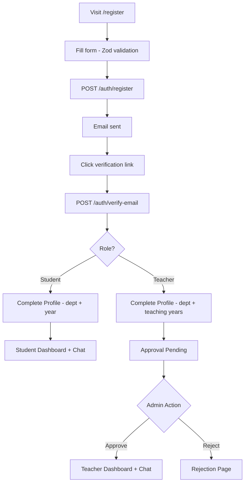

## 25.2 Authentication Workflow

See Section 11 sequence diagrams.

## 25.3 Admin Workflow

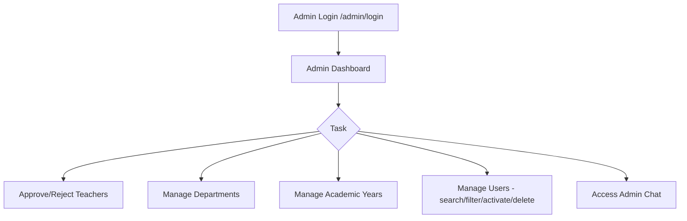

## 25.4 Chat Messaging Workflow

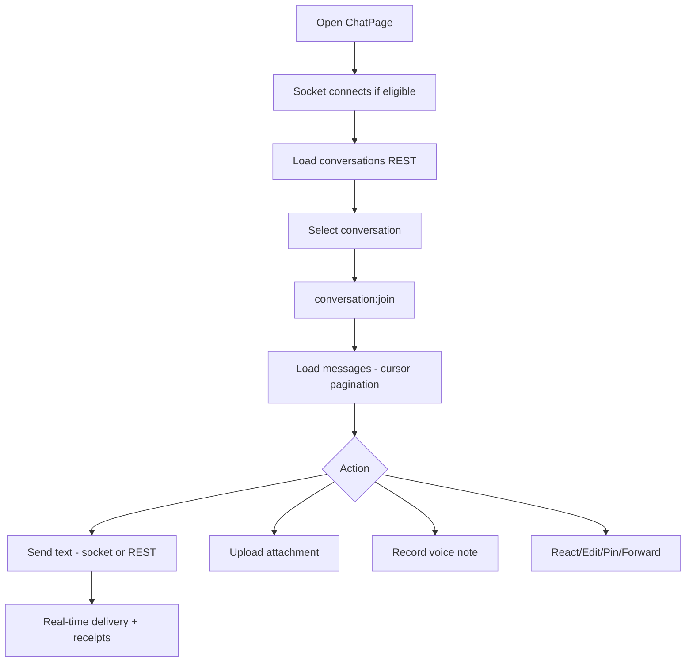

## 25.5 Teacher Approval Workflow

See Section 12.3 flowchart.

## 25.6 Campus AI Workflow

**Not applicable — module not implemented.**

---

# 26. Future Scope

Features **genuinely not implemented** in the current codebase:

| Feature | Notes |
|---------|-------|
| **Campus AI / Gemini Integration** | No AI code exists |
| **Forgot / Reset Password** | No routes or UI |
| **Push Notifications** | In-app only; no FCM/web push |
| **Message Virtualization** | ChatPage renders full message list |
| **Memory-only Access Tokens** | Tokens stored in localStorage |
| **Offline Support / Service Workers** | Not implemented |
| **Analytics Dashboard** | No usage analytics beyond admin user counts |
| **HTTP Rate Limiting** | Only socket-level limits |
| **CSRF Protection** | Not implemented |
| **Two-Factor Authentication** | Not implemented |
| **TURN/SFU Media Server** | Client mesh only; optional TURN env vars |
| **E2E Test Suite** | No Cypress/Playwright |
| **Test Coverage Reporting** | No coverage tooling |
| **Reduced Motion Support** | No prefers-reduced-motion CSS |
| **TypeScript Migration** | JavaScript only |
| **Message @mentions UI** | Model supports mentions; full UI unclear |
| **Link Preview Generation** | Model has linkPreview subdoc; generation not verified |

---

# 27. Challenges Faced

Based on implementation complexity observed in the codebase:

## 27.1 Real-Time State Synchronization

Maintaining consistent chat state across REST loads, optimistic socket sends, edits, deletes, and reactions required dedicated pure-function reducers (`chatRealtimeState.js`, `chatPhase5State.js`) and extensive backend tests (41 cases).

## 27.2 Chat Authorization Policy

The `chatPolicyService` (~1000 lines) encodes nuanced rules for direct chats, group types, department/year scoping, and member management — a significant design challenge for campus-specific access control.

## 27.3 WebRTC Mesh Architecture

Implementing multi-peer mesh connections with ICE restart, screen sharing, and socket signaling (`useWebRTCCall.js`) without a dedicated media server required careful peer lifecycle management.

## 27.4 Token Refresh Concurrency

The Axios refresh queue (`refreshPromise` singleton) prevents race conditions when multiple API calls receive 401 simultaneously — a common pitfall in JWT-based SPAs.

## 27.5 Teacher Approval State Machine

Coordinating backend gates (`canUseChat`, socket auth) with frontend routing (`ProtectedRoute` with 260+ lines of redirect logic) ensures teachers cannot bypass approval via direct URL access.

## 27.6 Message Idempotency

Duplicate message prevention via `temporaryId` partial unique index handles rapid socket retries and network flakiness.

## 27.7 File Upload Security

Balancing Multer MIME whitelisting, size limits, and static file serving with Helmet's cross-origin resource policy required explicit configuration.

## 27.8 Monolithic ChatPage

The chat UI consolidated into a single large component presents maintenance challenges — a known trade-off during rapid feature development (Phase 5 features: reactions, calls, voice, search).

---

# 28. Conclusion

CampusConnect is a **production-oriented full-stack campus communication platform** built with modern MERN technologies. It successfully delivers:

- **Secure multi-role authentication** with email verification, JWT sessions, and refresh token rotation
- **Structured user onboarding** with profile completion and teacher approval workflows
- **Comprehensive admin tooling** for departments, academic years, and user lifecycle management
- **Feature-rich real-time chat** including typing indicators, read receipts, reactions, edits, pins, forwards, file/voice attachments, and in-app notifications
- **WebRTC audio/video calling** with full signaling infrastructure
- **59 automated tests** covering chat policy, integration, and socket behavior

The architecture follows **clean separation of concerns** — controllers, services, policy layer, and socket handlers — enabling maintainability and testability. The frontend employs **React Context, lazy loading, and pure state reducers** for a responsive Discord-inspired experience across devices.

The **Campus AI module remains future work**, as no generative AI integration exists in the current codebase. Similarly, password recovery, push notifications, and advanced analytics represent natural extension points.

CampusConnect demonstrates practical software engineering skills applicable to **final-year project submission, internship portfolios, and GitHub documentation**, with a clear roadmap for enterprise-grade enhancements.

---

# 29. References

| Technology | Official Documentation |
|------------|-------------------------|
| React | https://react.dev |
| Vite | https://vite.dev |
| Tailwind CSS | https://tailwindcss.com/docs |
| React Router | https://reactrouter.com |
| React Hook Form | https://react-hook-form.com |
| Zod | https://zod.dev |
| Axios | https://axios-http.com |
| Socket.IO | https://socket.io/docs/v4 |
| Node.js | https://nodejs.org/docs |
| Express | https://expressjs.com |
| Mongoose | https://mongoosejs.com |
| MongoDB | https://www.mongodb.com/docs |
| JWT (jsonwebtoken) | https://github.com/auth0/node-jsonwebtoken |
| bcrypt | https://github.com/kelektiv/node.bcrypt.js |
| Helmet | https://helmetjs.github.io |
| Multer | https://github.com/expressjs/multer |
| Nodemailer | https://nodemailer.com |
| WebRTC API | https://developer.mozilla.org/en-US/docs/Web/API/WebRTC_API |
| Vitest | https://vitest.dev |
| Supertest | https://github.com/ladjs/supertest |
| Testing Library | https://testing-library.com |

---

## Appendix A: Environment Variables Quick Reference

```env
# Backend (campus-api/.env)
MONGO_URI=
JWT_ACCESS_SECRET=
JWT_REFRESH_SECRET=
JWT_ACCESS_EXPIRES_IN=15m
JWT_REFRESH_EXPIRES_IN=7d
PORT=5000
NODE_ENV=development
CLIENT_URL=http://localhost:5173
BCRYPT_SALT_ROUNDS=12
EMAIL_HOST= EMAIL_PORT= EMAIL_USER= EMAIL_PASSWORD= EMAIL_FROM_ADDRESS=
WEBRTC_STUN_URLS=
WEBRTC_TURN_URL= WEBRTC_TURN_USERNAME= WEBRTC_TURN_CREDENTIAL=

# Frontend (campus-web/.env)
VITE_API_URL=http://localhost:5000/api/v1
VITE_SOCKET_URL=http://localhost:5000
```

## Appendix B: Screenshot Placeholder Index

| # | Screenshot | Location |
|---|------------|----------|
| 1 | Cover / Logo | Section 1 |
| 2 | Landing Page | Section 3 |
| 3 | Login & Register | Section 11 |
| 4 | Email Verification | Section 11 |
| 5 | Student Profile Completion | Section 12 |
| 6 | Teacher Approval Pending | Section 12 |
| 7 | Admin Dashboard | Section 13 |
| 8 | Department Management | Section 13 |
| 9 | User Management | Section 13 |
| 10 | Chat Interface (Desktop) | Section 14 |
| 11 | Chat Interface (Mobile) | Section 22 |
| 12 | Voice Recorder | Section 14 |
| 13 | Video Call Overlay | Section 15 |
| 14 | Notification Center | Section 14 |
| 15 | Architecture Diagram Export | Section 8 |

---

**Report generated from source-code analysis of CampusConnect v1.0.0**  
**Author:** Mansi Thakur | **Date:** July 31, 2026
